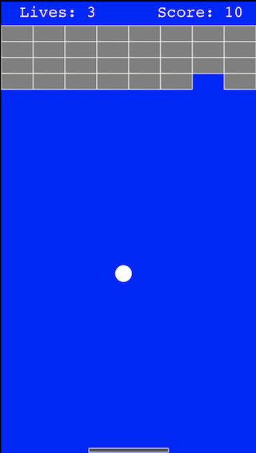

# Breakout
An iOS version of Breakout using SpriteKit.

## Description
My program allows the user to play a game of breakout inside a virtual environment.
I used Swift and coded it in version 12 of Xcode. You will need to have Xcode installed
to run my program. You can open my program by clicking on the Breakout.xcodeproj file,
you should then be able to run it by going to the game scene and clicking the play 
button in the top right. 



## The Code
The program itself is run by a series of functions inside different classes.
These functions are all called by one main function called startGame().
```swift
   func startGame() {
       self.scene?.removeAllChildren()
       createPhysics()
       createBalls()
       createPaddle()
       createBarriers()
       createBricks()
       createScore()
       createLives()
       gameOverLabel = nil
    }
```
There are also many different classes, each with their own functions.
For example, the SolidRectangle class creates a solid rectangle, 
unaffected by gravity. The Paddle, Barrier, and Brick classes are 
subclasses of Solid rectangle because they are all rectangles
unaffected by gravity, but they each have different properties
and functions.

I also have a class called BreakoutConstants that I created to
store all of the constants in my code.
```swift
class BreakoutConstants {
    let defaultWidth: CGFloat = 320
    var actualWidth: CGFloat = 320
    var safeAreaInsets = UIEdgeInsets.zero
    var designRatio: CGFloat {
        return actualWidth/defaultWidth
    }
```
This class uses the designRatio constant to adjust the value
of each constant depending on the size of the device the 
game is being run on. It uses the width of an iPod touch
as a reference.

## The Game
Running the program allows the user to play a game of breakout.
The you can move the paddle by clicking and holding down the mouse 
on the area of the screen you want the paddle to move.
The goal is to hit all of the bricks, if your can clear the
screen of every brick, a win screen will appear and you will 
have the option to play again by clicking anywhere on the screen.
Your score and lives can be seen at the top of the screen, you
start with three lives and if you run out, a game over screen
will appear.


